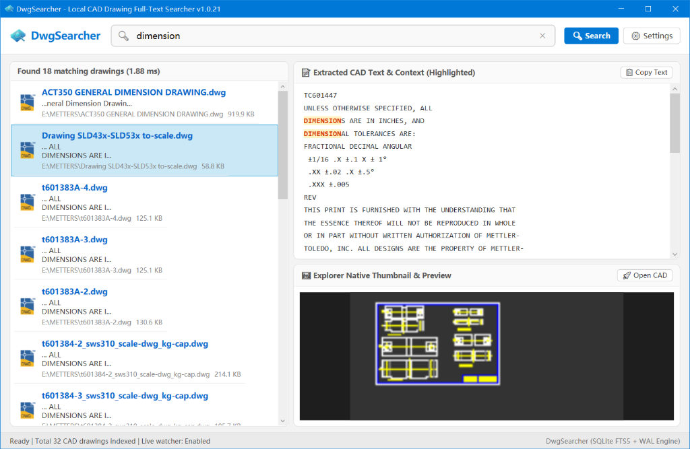
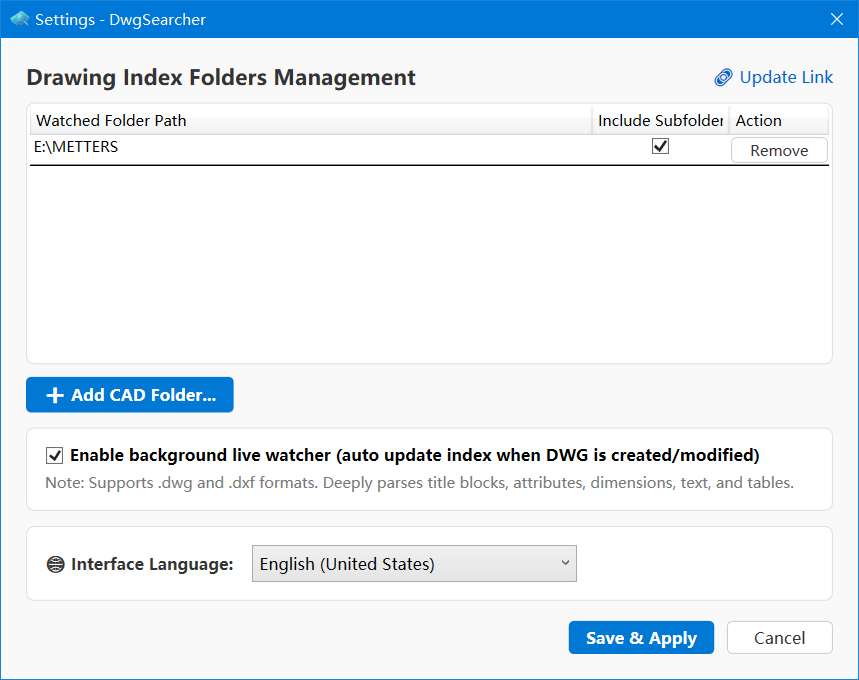

# DwgSearcher 🔍

> **The ultimate solution for searching text in DWG drawings (without AutoCAD).**  
> Easily perform **searching multiple DWG files for text** and **search across multiple files and directories for particular words in DWG/DXF files** in milliseconds! Stop opening drawings one by one—find drawing numbers, BOM tables, dimensions, technical requirements, and title block attributes instantly.

<p align="center">
  <a href="README_cn.md">简体中文</a> | <b>English</b>
</p>

<p align="center">
  
  
  
  
  
</p>

---

## 🎯 Why DwgSearcher?

- **Searching text in DWG drawings without AutoCAD**: 100% standalone. No need to install, license, or wait for AutoCAD / CAD software to start up.
- **Searching multiple DWG files for text**: Simultaneously search thousands of `.dwg` and `.dxf` files across your hard drives or local network shares.
- **Search across multiple files and directories for particular words**: Batch recursive directory search with instant SQLite FTS5 inverted index lookups.
- **Find everything inside CAD drawings**: Extracts text from drawing title blocks, block attributes (`ATTRIB`), dimensions, tolerances, MText, notes, and BOM tables.


---

## 📸 Screenshots

### 1. Main Search Interface
*Real-time search results, keyword highlighting in extracted CAD text, and native thumbnail preview:*


### 2. Settings & Folder Management
*Easily configure drawing directories, toggle real-time background indexing, and switch interface language:*


---

## ✨ Key Features

- ⚡ **Millisecond-Level Full-Text Search**
  - Powered by **SQLite FTS5** inverted index with `tokenize = 'trigram'`.
  - Seamlessly matches English, Chinese, symbols, and intricate drawing/part numbers (e.g., `FG5738100-2C`, `DN100`, `M12-8.8`, `Bracket`) with zero blind spots.
  - 150ms debounce for instant, as-you-type search results.

- 📐 **Deep CAD Entity Extraction**
  - **Single & Multi-line Text**: `TEXT`, `MTEXT`.
  - **Title Blocks & Block Attributes**: Block references attributes (`INSERT -> ATTRIB`), attribute definitions (`ATTDEF`).
  - **Dimensions & Tolerances**: Dimension measurements and override text (`DIMENSION`), geometric tolerances (`TOLERANCE`).
  - **Tables & BOMs**: Native CAD table (`TableEntity`) cell texts and Bills of Materials.
  - **Leaders & External References**: Multi-leaders (`MultiLeader`), XRef paths (`XREF`).
  - **Drawing Metadata**: Summary information (`SummaryInfo`), title, author, subject, hyperlinks, and custom properties.

- 🧹 **Intelligent AutoCAD Format Cleaning (`CadTextCleaner`)**
  - High-performance pre-compiled regex engine strips AutoCAD MText formatting control codes (e.g., `\A1;`, `\P`, `\f...;`, `{\H1.5x;...}`, `\S+0.02^-0.01;`), producing clean, readable plain text.

- 🖥 **Modern Desktop Interface (WPF)**
  - **Left Panel**: Result list displaying matching files, native Windows associated CAD icons, file sizes, paths, and matching snippet summaries.
  - **Top-Right Panel**: Full extracted CAD text context with matched keywords prominently highlighted in yellow, auto-scrolling to the first match.
  - **Bottom-Right Panel**: High-definition thumbnail preview powered by Windows Shell thumbnail handlers and embedded DWG bitmap extractors.

- 🔄 **Silent Background Watcher & Incremental Sync**
  - Configure multiple monitored folders with recursive subdirectory support.
  - Uses `FileSystemWatcher` with debounced events: automatically re-extracts and incrementally indexes drawings when created, modified, or saved.
  - Zero startup lag: the UI is instantly interactive while background indexing runs in a separate non-blocking thread.

- 🌐 **Multi-Language Support (i18n)**
  - Built-in live language switching between **English (United States)** and **简体中文 (Simplified Chinese)**.

---

## 📖 User Guide

### 1. First-Time Setup: Configure Watched Folders
1. Launch `DwgSearcher`, then click **"⚙️ Settings"** in the top-right corner.
2. In the settings dialog, click **"➕ Add CAD Folder..."** to select your local or network CAD drawing folder.
3. Check **"Include Subfolder"** to recursively scan nested directories.
4. Check **"Enable background live watcher"** (recommended) so changes made in AutoCAD/CAD editors are automatically indexed.
5. Click **"Save & Apply"**. The background engine will scan and index your drawings automatically.

### 2. Searching Drawings
- **Instant Search**: Type any keyword, part code, material name, or dimension specification in the search box (e.g., `dimension`, `flange`, `SUS304`, `DN50`).
- **Multi-Word Search**: Separate multiple search terms with spaces to narrow down results.
- **Clear Search**: Click the `×` button on the search box to clear the input and view all indexed drawings.

### 3. Inspecting & Interacting with Drawings
- **Review Text & Context**: Click any drawing in the left list. The top-right panel shows all extracted text from the drawing with keywords highlighted.
- **Preview Graphics**: View the drawing layout or model thumbnail in the bottom-right panel to confirm drawing revisions.
- **Open CAD File**:
  - **Double-click** any item in the search list;
  - Or select an item and click **"🚀 Open CAD"** to open it immediately with your default CAD software (AutoCAD, GstarCAD, ZWCAD, etc.).
- **Right-Click Context Menu**:
  - **Open File**: Launch the drawing in your default CAD viewer.
  - **Open Containing Folder**: Open Windows File Explorer with the file selected.
  - **Copy Full Path**: Copy the absolute file path to the clipboard.
- **Copy Extracted Text**: Click **"📋 Copy Text"** in the top-right pane to copy all extracted plain text to your clipboard for easy pasting into Excel, Word, ERP, or PLM systems.

---

## 🛠 System Architecture

```text
DwgSearcher/
├── App.xaml / App.xaml.cs          # WPF application lifecycle & global styles
├── Views/
│   ├── MainWindow.xaml (.cs)       # Main window (search bar, 3-pane layout, preview integration)
│   └── SettingsWindow.xaml (.cs)   # Settings window (folder management, watcher toggle, i18n)
├── ViewModels/
│   └── SearchResultItem.cs         # Result item view model & Windows Shell icon bindings
├── Engine/
│   ├── IndexingEngine.cs           # Incremental scanner, hash comparison & batch transaction engine
│   └── SearchEngine.cs             # FTS5 Trigram inverted index search & BM25 ranking engine
├── Storage/
│   ├── DatabaseManager.cs          # SQLite FTS5 virtual table & WAL mode connection manager
│   └── PathHelper.cs               # App data path resolver
├── Services/
│   ├── ConfigService.cs            # JSON configuration persistence
│   ├── FileWatcherService.cs       # Multi-folder FileSystemWatcher with debouncing
│   ├── ShellThumbnailHelper.cs     # Windows Shell API thumbnail & icon provider
│   ├── DwgPreviewExtractor.cs      # Binary DWG embedded bitmap fallback extractor
│   └── LocalizationService.cs      # Dynamic localization & language dictionary provider
└── TextExtraction/
    ├── CadTextCleaner.cs           # Regex pipeline stripping MText formatting codes
    └── DwgTextExtractor.cs         # ACadSharp-based comprehensive CAD entity extractor
```

---

## 🚀 Build & Deployment

### Prerequisites
- **OS**: Windows 10 / Windows 11 (x64)
- **SDK**: [.NET 8.0 SDK or .NET 10.0 SDK](https://dotnet.microsoft.com/download)

### Run from Source
```powershell
# Clone the repository
git clone https://github.com/funekaa/DwgSearcher.git
cd DwgSearcher

# Build and run
dotnet run
```

### Publish Single-File Standalone Executable (.exe)
```powershell
dotnet publish -c Release -r win-x64 --self-contained true /p:PublishSingleFile=true /p:IncludeNativeLibrariesForSelfExtract=true
```
The standalone executable will be generated at:  
`bin/Release/net10.0-windows/win-x64/publish/DwgSearcher.exe` (no need for users to install .NET runtime separately).

---

## 📄 License

This project is licensed under the [MIT License](LICENSE). Contributions, issues, and feature requests are welcome!
